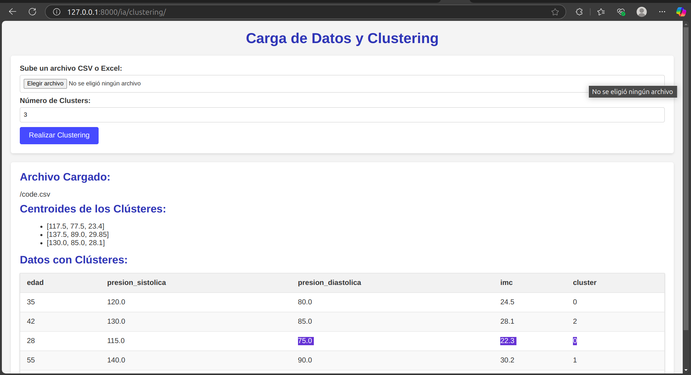
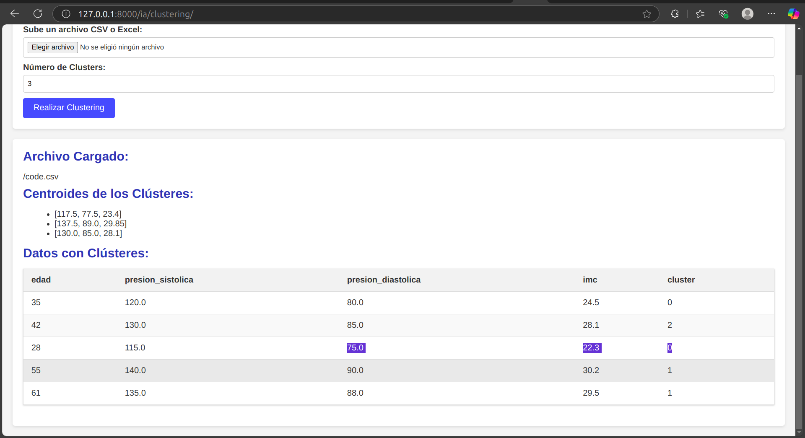

# Sistema de Diagnóstico Médico con IA, ML y DL

## Descripción del Proyecto

Este proyecto tiene como objetivo desarrollar un sistema de diagnóstico médico que aproveche el poder de la Inteligencia Artificial (IA), el Aprendizaje Automático (Machine Learning, ML) y el Aprendizaje Profundo (Deep Learning, DL) para mejorar y agilizar el proceso de diagnóstico. El sistema se implementa utilizando el framework Django para Python, lo que proporciona una base sólida para crear una aplicación web escalable, mantenible y fácil de usar. La arquitectura del proyecto se basa en una clara separación de responsabilidades, con módulos independientes para cada área (IA, ML y DL).

**Planteamiento del Problema:**

El desafío principal consiste en integrar módulos de IA, ML y DL en un proyecto Django existente, siguiendo buenas prácticas de desarrollo de software. El sistema resultante debe ser:

- **Escalable:** Capaz de manejar un creciente volumen de datos y usuarios sin degradar su rendimiento.
- **Mantenible:** Con una estructura de código clara, modular y bien documentada que facilite futuras modificaciones y actualizaciones.
- **Con Separación de Responsabilidades:** Cada módulo (IA, ML, DL) debe tener una función específica y bien definida, evitando la mezcla de lógicas y dependencias innecesarias.

**Requisitos Específicos:**

1.  **Módulo de IA:**

    - Implementar un algoritmo de clustering (como K-Means) usando la biblioteca scikit-learn.
    - Desarrollar una vista en Django que permita a los usuarios cargar datos (en formatos como CSV o Excel) y visualizar los resultados del clustering de forma interactiva.

2.  **Módulo de ML:**

    - Implementar un modelo de clasificación (como Random Forest) usando scikit-learn.
    - Implementar un mecanismo para almacenar el modelo entrenado (en la carpeta `ml/models/`) y cargarlo dinámicamente cuando sea necesario para realizar predicciones.
    - Crear una API REST en Django que permita a los usuarios enviar datos y obtener predicciones del modelo.

3.  **Módulo de DL:**

    - Implementar una red neuronal simple (por ejemplo, una Multi-Layer Perceptron o MLP) usando TensorFlow o PyTorch.
    - Crear una vista en Django que permita a los usuarios cargar imágenes y obtener predicciones del modelo de DL.

4.  **Gestión de Datos:**
    - Almacenar los conjuntos de datos de entrenamiento y prueba en carpetas separadas (`ml/datasets/` para ML y `dl/datasets/` para DL).
    - Implementar pipelines de preprocesamiento de datos para ML (`ml/pipelines/`) y DL (`dl/utils/`).

**Reto Principal:**

El reto final es construir un sistema de diagnóstico médico cohesivo que integre los tres módulos (IA, ML y DL) de la siguiente manera:

- **Módulo de IA:** Clasifica los síntomas de los pacientes en grupos, identificando patrones y posibles grupos de riesgo.
- **Módulo de ML:** Predice la probabilidad de que un paciente tenga una enfermedad específica, basándose en sus síntomas.
- **Módulo de DL:** Analiza imágenes médicas (como radiografías) para detectar anomalías o indicadores de enfermedades.

## Avance del Proyecto

El proyecto se encuentra en una fase inicial de desarrollo. Se ha completado la implementación del módulo de IA, mientras que el módulo de ML se encuentra en una etapa de planteamiento y desarrollo inicial, y el módulo de DL aún no se ha abordado. A continuación, se detallan los logros y el estado actual de cada módulo:

### 1. Módulo de IA: Clasificación de Síntomas en Grupos (Completado)

**Objetivo:** Agrupar pacientes basándose en la similitud de sus características (edad, presión arterial, IMC, etc.) utilizando algoritmos de clustering. Esto permite identificar patrones y grupos de riesgo dentro de una población.

**Implementación:**

- **Algoritmo:** Se ha implementado el algoritmo K-Means, un algoritmo de clustering no supervisado, utilizando la biblioteca `scikit-learn`. K-Means divide los datos en _k_ grupos (clústeres) donde cada punto de datos pertenece al clúster con el centroide (media) más cercano.
- **Clase `KMeansCluster` (`ia/clustering.py`):** Esta clase encapsula la lógica del algoritmo K-Means. Permite:
  - Inicializar el modelo con un número específico de clústeres (`n_clusters`) y una semilla aleatoria para reproducibilidad (`random_state`).
  - Entrenar el modelo (`fit`) con un DataFrame de pandas.
  - Realizar predicciones (`predict`) sobre nuevos datos.
  - Obtener los centroides de los clústeres (`get_cluster_centers`) y las etiquetas de los clústeres asignadas a cada punto de datos (`get_labels`).
  - Manejo de errores: Valida que los datos de entrada sean DataFrames de pandas.
- **Vista de Django (`ia/views.py`):** Se ha creado una vista interactiva que permite a los usuarios:
  - Cargar un archivo CSV o Excel que contenga los datos de los pacientes.
  - Especificar el número de clústeres deseado.
  - Visualizar los resultados del clustering:
    - Centroides de cada clúster.
    - Tabla con los datos originales y la etiqueta del clúster asignado a cada paciente.
    - Manejo de errores:
      - Formato de archivo no soportado.
      - Errores durante el procesamiento de datos.
      - Visualización de mensajes de error descriptivos.
- **URLs (`ia/url.py` y `medical_diagnosis/urls.py`):** Se configura la URL `/ia/clustering/` para acceder a la vista de clustering.
- **Plantilla (`templates/clustering_results.html`):** Interfaz de usuario para la carga de archivos, configuración del número de clústeres y visualización de resultados. Incluye:
  - Formulario para subir archivos y especificar el número de clusters.
  - Manejo y visualización de errores.
  - Visualización clara de los centroides.
  - Tabla de resultados con formato y estilos mejorados (bordes, colores, etc.).
  - Adaptabilidad a diferentes tamaños de pantalla (responsive design).
- **Archivo de datos de ejemplo (`media/code.csv`):** Contiene datos de ejemplo (edad, presión sistólica, presión diastólica, IMC) para demostrar la funcionalidad del clustering.
- **Gestión de archivos:** Los archivos cargados se almacenan en la carpeta `media/` utilizando `FileSystemStorage` de Django, garantizando una gestión segura y organizada.
- Se utiliza la libreria de `pandas` para el manejo y procesamiento de datos tabulares.

**Diagrama del Flujo del Módulo de IA:**

graph LR
A[Usuario carga archivo CSV/Excel] --> B(Vista de Django: clustering_view);
B --> C{Archivo válido?};
C -- Sí --> D[Leer datos con pandas];
D --> E[Limpiar datos (eliminar NaN)];
E --> F[Seleccionar columnas numéricas];
F --> G[Crear instancia de KMeansCluster];
G --> H[Entrenar modelo (fit)];
H --> I[Obtener centroides y etiquetas];
I --> J[Agregar etiquetas a los datos];
J --> K[Renderizar plantilla con resultados];
C -- No --> L[Mostrar mensaje de error];
K --> M[Usuario ve resultados en la web];
L --> M;

### 2. Módulo de ML: Predicción de la Probabilidad de una Enfermedad (Planteamiento Inicial)

**Objetivo:** Predecir la probabilidad de que un paciente tenga una determinada enfermedad (por ejemplo, gripe, alergia, neumonía) basándose en sus síntomas.

**Planteamiento e Implementación Inicial:**

- **Algoritmo (Propuesta):** Se propone utilizar un modelo de clasificación Random Forest (`scikit-learn`). Random Forest es un algoritmo de ensamble que combina múltiples árboles de decisión. Se ha elegido este algoritmo por su robustez y capacidad de manejar datos con múltiples características. Sin embargo, la elección final del algoritmo podría ajustarse en función de los resultados experimentales.
- **Clase `SymptomClassifier` (`ml/classifier.py`):** Esta clase _se ha iniciado_ para gestionar el entrenamiento, carga y uso del modelo. Actualmente, la clase incluye:
  - `train()`: Función _parcialmente implementada_ que _pretende_ cargar datos, preprocesarlos, entrenar el modelo y guardarlo. _Falta la implementación completa de la lógica de entrenamiento, manejo de errores y evaluación del modelo_.
  - `load_model()`: Función _parcialmente implementada_ para cargar un modelo previamente entrenado. _Falta la implementación del manejo de errores_.
  - `predict()`: Función _parcialmente implementada_ que _pretende_ cargar el modelo (si es necesario), preprocesar los datos de entrada y realizar la predicción. _Falta la implementación completa de la lógica de preprocesamiento y predicción_.
- **Pipeline de Preprocesamiento (`ml/pipelines/preprocessing.py`):**
  - Función `create_preprocessing_pipeline`: Crea un pipeline de preprocesamiento _preliminar_. Este pipeline _está diseñado_ para manejar características numéricas y categóricas:
    - **Características numéricas:** Imputación de valores faltantes y escalado.
    - **Características categóricas:** Imputación de valores faltantes y codificación One-Hot.
    - Se utiliza `ColumnTransformer`.
- **API REST (`ml/views.py`):** Se ha creado una estructura _básica_ para la API REST, incluyendo:

  - `predict_symptom`: _Endpoint preliminar_ para realizar predicciones. _La implementación actual es un esqueleto y necesita ser completada_. Incluye el uso de un serializador.
  - `train_model_view`: _Endpoint preliminar_ para entrenar el modelo. _Falta la implementación completa de la logica y la correcta gestion de errores_.

- **Serializador (`ml/serializers.py`):**
  - `PredictionSerializer`: Define los campos que la API _esperaría_ recibir. _Este serializador está definido pero necesita ser adaptado a los datos finales que se utilizarán_.
- **URLs (`ml/urls.py` y `medical_diagnosis/urls.py`):** Se han definido las URLs _preliminares_ para los endpoints de predicción y entrenamiento.
- **Datos de entrenamiento (`ml/datasets/symptoms_dataset.csv`):** Se proporciona un conjunto de datos de _ejemplo_.

**Tareas Pendientes (Módulo ML):**

- **Completar la implementación de `SymptomClassifier`:**
  - Finalizar la lógica de entrenamiento, incluyendo la división de datos en conjuntos de entrenamiento y prueba, la evaluación del modelo y el manejo de errores.
  - Implementar completamente la carga del modelo y el manejo de errores.
  - Completar la lógica de preprocesamiento y predicción en `predict()`.
- **Desarrollar completamente la API REST:**
  - Completar la implementación de `predict_symptom`, incluyendo la integración con `SymptomClassifier` y el manejo de errores.
  - Implementar completamente `train_model_view`, integrándolo con `SymptomClassifier` y asegurando un manejo robusto de errores y validación de datos.
- **Ajustar y validar el pipeline de preprocesamiento:** Asegurarse de que el pipeline maneja correctamente los datos y mejora el rendimiento del modelo.
- **Seleccionar y ajustar hiperparámetros del modelo:** Experimentar con diferentes configuraciones del modelo Random Forest (u otros algoritmos) para optimizar el rendimiento.
- **Implementar métricas de evaluacion:** Agregar al metodo `train` metricas mas especificas como `precision_score`, `recall_score`, `f1_score`.

### 3. Módulo de DL: Análisis de Imágenes Médicas (No Iniciado)

Este módulo no se ha iniciado. Se planea utilizar TensorFlow o PyTorch.

**Tareas Pendientes (Módulo DL):**

- Todas las tareas relacionadas con el diseño, implementación, entrenamiento y evaluación del modelo de DL están pendientes.

## Consideraciones Generales

- **Escalabilidad y Mantenibilidad:** Se ha iniciado una estructura modular, pero _es crucial mantener y reforzar esta estructura a medida que se completa el módulo de ML y se inicia el módulo de DL_.
- **Buenas Prácticas:** Se han aplicado algunas buenas prácticas, pero _es necesario un esfuerzo continuo para asegurar que se sigan aplicando consistentemente_. Esto incluye:
  - Completar el manejo de errores en todas las partes del código.
  - Asegurar la correcta validación de datos.
  - Documentar exhaustivamente el código.
- **Estado del Proyecto:** El proyecto esta en desarrollo y se resalta que solo se completo el modulo IA, se planteo el modulo ML y que el modulo DL aun no se aborda.
- **Persistencia del Modelo (Modulo ML):** Se plantea guardar y cargar el modelo, pero la implementacion aun no es completa.
